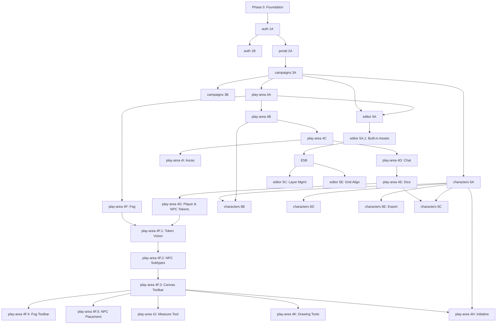

# VTT Roadmap

> Master overview only. Detailed tasks live in per-feature docs under `.project/features/`.

## Feature Status

| Slug        | Feature         | Phases           | Status      | Current Phase |
| ----------- | --------------- | ---------------- | ----------- | ------------- |
| `auth`      | Auth & Sessions | 1A–1B            | In Progress | 1A Complete   |
| `portal`    | Portal          | 2A–2B            | In Progress | 2A Complete   |
| `campaigns` | Campaigns       | 3A–3B            | Complete    | 3B Complete   |
| `play-area` | Play Area       | 4A–4K, 4F.1–4F.5 | In Progress | 4I Complete   |
| `editor`    | Campaign Editor | 5A–5E, 5A.1      | Complete    | 5E Complete   |

| `characters` | Character Sheets | 6A–6E | In Progress | 6A Complete |

> **Editor phase names updated 2026-06-10:** 5A → "Editor Mode & Asset Library", 5E → "Grid Alignment Tool"

## Cross-Cutting

| Phase | Name                       | Status   |
| ----- | -------------------------- | -------- |
| 0     | Foundation & Project Setup | Complete |

## Dependency Graph

## Feature Docs

Each feature has its own detailed document with phases, tasks, and decisions:

- [`.project/features/portal.md`](features/portal.md)
- [`.project/features/auth.md`](features/auth.md)
- [`.project/features/campaigns.md`](features/campaigns.md)
- [`.project/features/play-area.md`](features/play-area.md)
- [`.project/features/editor.md`](features/editor.md)
- [`.project/features/characters.md`](features/characters.md)
- [`.project/foundation.md`](foundation.md) — Phase 0: Foundation & Project Setup

## Phase 0: Foundation & Project Setup

See [`.project/foundation.md`](foundation.md) for tasks and status.

## Future (Post-MVP)

- Advanced authentication (WebAuthn, OAuth, MFA, rate limiting)
- Advanced combat engine (NPC stat blocks, automated attack rolls, damage resistance/vulnerability, AoE rendering, encounter difficulty calculator, combat log)
- Sound & ambience (integrated soundboard)
- Built-in voice & video chat
- Dynamic lighting and line-of-sight
- 3D dice integration (Three.js + cannon-es)
- Instant join via URL codes
- Compendium / rule lookup system
